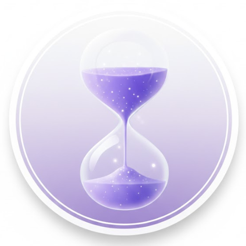
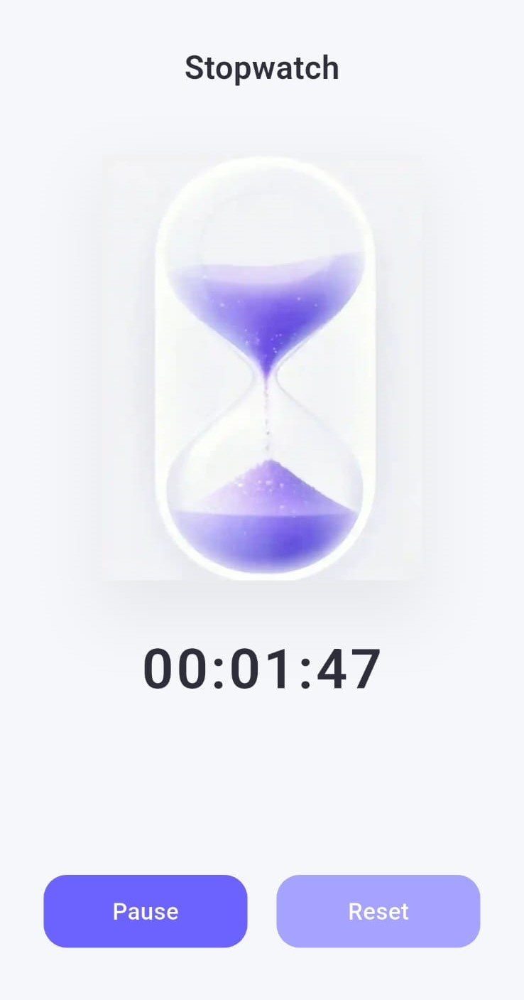

# ⏳ TickWise – Stopwatch App (PRODIGY_AD_03)

  
  
  
  
  
  

TickWise is a minimalist stopwatch application built as part of **Internship Task 3**.  
The app focuses on clarity, smooth performance, and intuitive UX by visualizing time through a **hourglass animation** rather than relying only on numbers.

---

## 🚀 Features

- Start, pause, and reset stopwatch
- Hourglass animation synced with stopwatch state
- Smooth transitions without UI breaks
- Clean and distraction-free interface

---

## 🎯 Product Perspective

- Visualizing time improves user engagement
- Animation pauses and resumes naturally with user actions
- Reset flow avoids abrupt or empty UI states
- Designed with clarity and feedback as first principles

---

## 🛠 Tech Stack

- Flutter
- Dart
- Lottie Animation

---

  

---
## 🎨 App Logo

  

---
## 📱 App Screenshot

  

